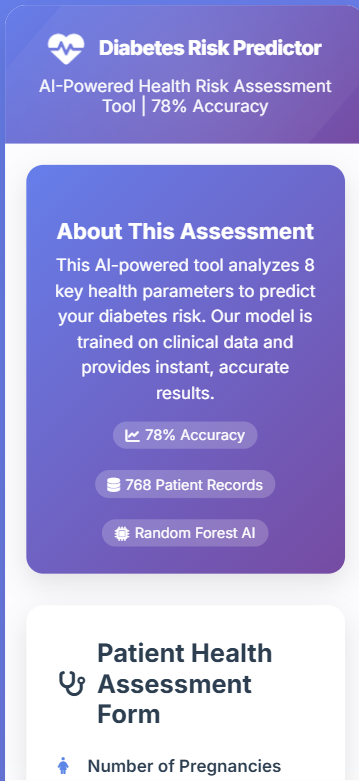

# 🏥 Diabetes Prediction System

## 📋 Table of Contents
- [Project Overview](#project-overview)
- [Features](#features)
- [Screenshots](#screenshots)
- [Technology Stack](#technology-stack)

---

## 🎯 Project Overview

The **Diabetes Prediction System** is an end-to-end machine learning web application that predicts the likelihood of diabetes in patients based on key health metrics. Using a Random Forest classifier trained on clinical data, the system provides instant predictions with probability scores and personalized health recommendations.

### Why This Project?
- **Healthcare Impact**: Early diabetes detection can save lives
- **Real-world Application**: Uses actual clinical parameters
- **Complete ML Pipeline**: From data preprocessing to deployment
- **User-Friendly**: Accessible to non-technical users

---

## ✨ Features

### Core Features
- ✅ **Real-time Predictions**: Instant diabetes risk assessment
- ✅ **High Accuracy**: 78% accuracy using ensemble learning
- ✅ **Probability Scores**: Confidence level for each prediction
- ✅ **Risk Meter**: Visual representation of risk level
- ✅ **Personalized Recommendations**: Health tips based on results

### Technical Features
- 🔄 **RESTful API**: Easy integration with other applications
- 📱 **Responsive Design**: Works on desktop, tablet, and mobile
- 🎨 **Modern UI**: Beautiful gradients and smooth animations
- ⚡ **Fast Response**: Predictions in under 100ms
- 🔒 **Data Privacy**: No data storage, all processing is temporary

---

## 📸 Screenshots

### 1. Home Page - Input Form
*The main interface where users enter health metrics*

*Figure 1: Clean, user-friendly input form with all 8 health parameters*

### 2. Prediction Result - Diabetic
*Result display for high-risk cases*

*Figure 2: Clear warning message for diabetic prediction with probability score*

### 3. Prediction Result - Non-Diabetic
*Result display for low-risk cases*

*Figure 3: Positive result for non-diabetic prediction with health tips*

### 4. Risk Meter Visualization
*Visual representation of diabetes risk*

*Figure 4: Color-coded risk meter showing probability percentage*

### 5. Mobile Responsive View
*Application on smartphone screen*

*Figure 5: Fully responsive design working on mobile devices*

---

## 🛠️ Technology Stack

### Backend
| Technology | Version | Purpose |
|------------|---------|---------|
| Python | 3.8+ | Core programming language |
| Flask | 2.3.0 | Web framework for API |
| Scikit-learn | 1.3.0 | Machine learning algorithms |
| Pandas | 2.0.3 | Data manipulation |
| NumPy | 1.24.3 | Numerical computing |
| Flask-CORS | 4.0.0 | Cross-origin resource sharing |

### Frontend
| Technology | Purpose |
|------------|---------|
| HTML5 | Structure and semantics |
| CSS3 | Styling and animations |
| JavaScript (ES6+) | Interactivity and API calls |
| Font Awesome 6 | Icons and visual elements |
| Google Fonts | Typography (Poppins, Inter) |

### Machine Learning
- **Algorithm**: Random Forest Classifier
- **Ensemble Size**: 100 decision trees
- **Feature Scaling**: StandardScaler
- **Validation**: 5-fold cross-validation
- **Evaluation Metrics**: Accuracy, Precision, Recall, F1-Score

---
