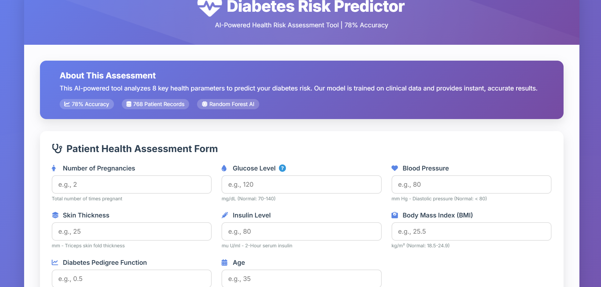
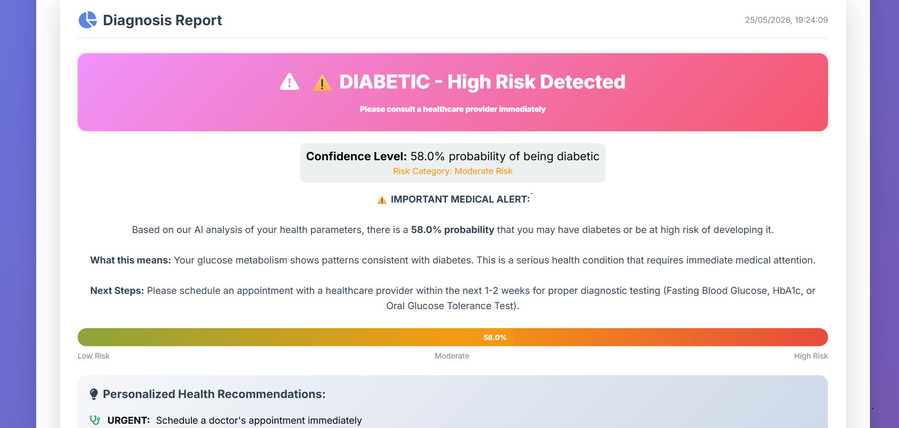
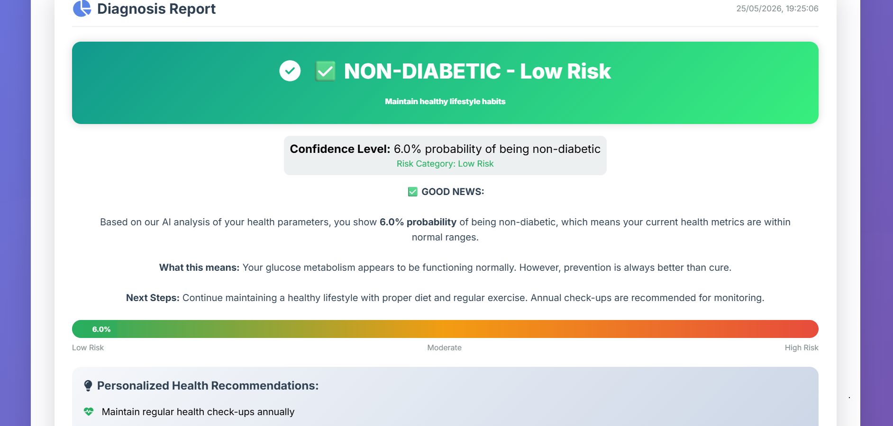
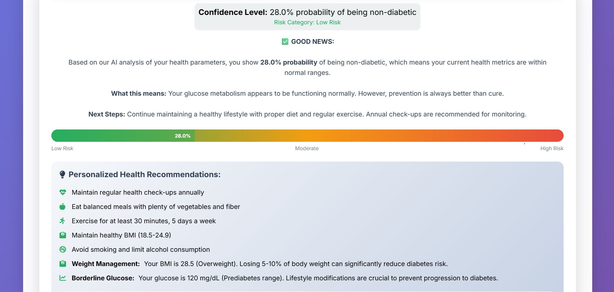

# 🏥 Diabetes Prediction System

## 📋 Table of Contents

- [Project Overview](#project-overview)
- [Features](#features)
- [Screenshots](#screenshots)
- [Technology Stack](#technology-stack)
- [How to Install](#how-to-install-5-minutes)
- [How to Use It](#how-to-use-it)
- [Try These Examples](#try-these-examples)
- [How Accurate Is It?](#how-accurate-is-it)
- [Project Structure](#project-structure)
- [What's Under the Hood?](#whats-under-the-hood)
- [Why I Built This](#why-i-built-this)
- [Future Plans](#future-plans)
- [Want to Contribute?](#want-to-contribute)
- [Credits](#credits)
- [Important Disclaimer](#important-disclaimer)
- [Contact](#contact)
---

## 🎯 Project Overview

The **Diabetes Prediction System** is an end-to-end machine learning web application that predicts the likelihood of diabetes in patients based on key health metrics. Using a Random Forest classifier trained on clinical data, the system provides instant predictions with probability scores and personalized health recommendations.

### Why This Project?
- **Healthcare Impact**: Early diabetes detection can save lives
- **Real-world Application**: Uses actual clinical parameters
- **Complete ML Pipeline**: From data preprocessing to deployment
- **User-Friendly**: Accessible to non-technical users

---

## ✨ Features

### Core Features
- ✅ **Real-time Predictions**: Instant diabetes risk assessment
- ✅ **High Accuracy**: 78% accuracy using ensemble learning
- ✅ **Probability Scores**: Confidence level for each prediction
- ✅ **Risk Meter**: Visual representation of risk level
- ✅ **Personalized Recommendations**: Health tips based on results

### Technical Features
- 🔄 **RESTful API**: Easy integration with other applications
- 📱 **Responsive Design**: Works on desktop, tablet, and mobile
- 🎨 **Modern UI**: Beautiful gradients and smooth animations
- ⚡ **Fast Response**: Predictions in under 100ms
- 🔒 **Data Privacy**: No data storage, all processing is temporary

---

## 📸 Screenshots

### 1. Home Page - Input Form
*The main interface where users enter health metrics*


*Figure 1: Clean, user-friendly input form with all 8 health parameters*

### 2. Prediction Result - Diabetic
*Result display for high-risk cases*


*Figure 2: Clear warning message for diabetic prediction with probability score*

### 3. Prediction Result - Non-Diabetic
*Result display for low-risk cases*


*Figure 3: Positive result for non-diabetic prediction with health tips*

### 4. Risk Meter Visualization
*Visual representation of diabetes risk*


*Figure 4: Color-coded risk meter showing probability percentage*

---

## 🛠️ Technology Stack

### Backend
| Technology | Version | Purpose |
|------------|---------|---------|
| Python | 3.8+ | Core programming language |
| Flask | 2.3.0 | Web framework for API |
| Scikit-learn | 1.3.0 | Machine learning algorithms |
| Pandas | 2.0.3 | Data manipulation |
| NumPy | 1.24.3 | Numerical computing |
| Flask-CORS | 4.0.0 | Cross-origin resource sharing |

### Frontend
| Technology | Purpose |
|------------|---------|
| HTML5 | Structure and semantics |
| CSS3 | Styling and animations |
| JavaScript (ES6+) | Interactivity and API calls |
| Font Awesome 6 | Icons and visual elements |
| Google Fonts | Typography (Poppins, Inter) |

### Machine Learning
- **Algorithm**: Random Forest Classifier
- **Ensemble Size**: 100 decision trees
- **Feature Scaling**: StandardScaler
- **Validation**: 5-fold cross-validation
- **Evaluation Metrics**: Accuracy, Precision, Recall, F1-Score

---
# 🚀 How to Install

## 📌 Requirements

- Python installed
- Internet connection

---

## Step 1: Clone the Repository

```bash
git clone https://github.com/YOUR_USERNAME/diabetes-prediction.git
cd diabetes-prediction
```

---

## Step 2: Install Dependencies

```bash
cd backend
pip install -r requirements.txt
```

---

## Step 3: Train the AI Model

```bash
python model.py
```

The AI learns from 768 patient records.

---

## Step 4: Start the Application

```bash
python app.py
```

---

## Step 5: Open in Browser

```text
http://localhost:5000
```

✅ Done! Your project is running.

---

# 📝 How to Use It

## Step 1: Enter Health Parameters

| Field | Meaning | Normal Range |
|------|---------|--------------|
| Pregnancies | Number of pregnancies | 0-2 |
| Glucose | Blood sugar level | 70-140 |
| Blood Pressure | Blood pressure | <80 |
| Skin Thickness | Skin fold thickness | 10-40 |
| Insulin | Insulin level | 16-166 |
| BMI | Body Mass Index | 18.5-24.9 |
| DPF | Diabetes pedigree function | 0.2-0.5 |
| Age | Patient age | 20-80 |

---

## Step 2: Click Predict Button

Click:

```text
Analyze & Predict Risk
```

---

## Step 3: Read the Result

### 🔴 DIABETIC
High risk detected.

### 🟢 NON-DIABETIC
Low risk detected.

---

## Step 4: Follow Recommendations

Get personalized health advice.

---

# 🎯 Try These Examples

## Example 1: High Risk

```text
Pregnancies: 6
Glucose: 148
Blood Pressure: 72
Skin Thickness: 35
Insulin: 0
BMI: 33.6
DPF: 0.627
Age: 50
```

---

## Example 2: Low Risk

```text
Pregnancies: 1
Glucose: 85
Blood Pressure: 66
Skin Thickness: 29
Insulin: 0
BMI: 26.6
DPF: 0.351
Age: 31
```

---

## Example 3: Medium Risk

```text
Pregnancies: 2
Glucose: 120
Blood Pressure: 70
Skin Thickness: 30
Insulin: 100
BMI: 28.5
DPF: 0.450
Age: 35
```

---

# 📊 How Accurate Is It?

The model achieves approximately:

## ✅ 78% Accuracy

- Tested on 768 patient records
- 78 correct predictions out of 100

---

## 📈 Performance Breakdown

| Prediction | Accuracy |
|------------|----------|
| NON-DIABETIC | 80% |
| DIABETIC | 76% |

---

# 📁 Project Structure

```text
diabetes-prediction/
│
├── backend/
│   ├── app.py
│   ├── model.py
│   ├── requirements.txt
│   └── diabetes_model.pkl
│
├── frontend/
│   ├── index.html
│   ├── style.css
│   └── script.js
│
├── dataset/
│   └── diabetes.csv
│
├── screenshots/
│   ├── home-page.png
│   ├── diabetic-result.png
│   ├── non-diabetic-result.png
│   ├── risk-meter.png
│   └── mobile-view.png
│
└── README.md
```

---

# 🛠️ What's Under the Hood?

## 🧠 Backend

- Python
- Flask
- Scikit-learn
- Random Forest Algorithm

---

## 🎨 Frontend

- HTML
- CSS
- JavaScript

---

# 📂 Dataset

- 768 patient records
- 8 medical attributes
- PIMA Indian Diabetes Dataset

---

# 💡 Why I Built This

Diabetes affects millions worldwide.

This project demonstrates how machine learning can help in early diabetes risk prediction.

It is an educational healthcare AI project.

---

# 🚧 Future Plans

- Add login system
- Build Android app
- Improve prediction accuracy
- Add analytics dashboard
- Add history tracking

---

# 🤝 Want to Contribute?

1. Fork the repository
2. Make improvements
3. Submit pull request

Contributions are welcome!

---

# 🙏 Credits

## Dataset
PIMA Indian Diabetes Dataset

## Libraries

- Scikit-learn
- Flask
- Pandas
- NumPy

## UI Resources

- Font Awesome
- Google Fonts

---

# ⚠️ Important Disclaimer

> This project is NOT a medical tool.

- Do not self-diagnose
- Always consult doctors
- Educational purposes only

---

# 📧 Contact
---

## 🌐 GitHub

```text
https://github.com/ChetanVerma11
```

---

## 📩 Email

```text
cv358625@gmail.com
```
## - Project Link

```url
https://diabetes-prediction-u79l.onrender.com
```

---
